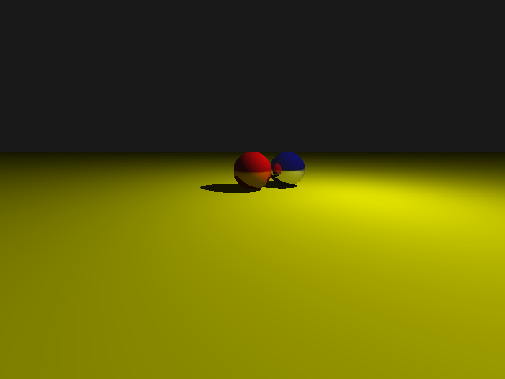

# Beamline

Beamline is an open-source, CLI-based path tracer that supports CPU-based rendering and GPU-accelerated hybrid rendering. It is designed to be modular, extensible, and easy to use with a flexible `.beam` scene format.

 
**Current quality of the path tracing, showing two rubber balls in the distance next to each other**
---

## Features (v1.0.1940)

- CPU-based path tracing renderer
- Flexible `.beam` scene format for defining cameras, lights, spheres, and planes
- PPM and PNG output formats
- Command-line interface for rendering and scene inspection
- Detailed timing and status output
--------------------

## Getting Started

### Build

Beamline uses a standard C++ build system. Clone the repo and build:

```bash
git clone https://github.com/bluegillstudios/beamline
cd beamline
mkdir build && cd build
cmake ..
make
```
## Usage

```
beamline <scene_file.beam> [width height]
Example:
beamline scenes/cornell.beam 800 600
```

To print scene info only:
```
beamline scenes/cornell.beam --info
```
-----------------------------

# Working with .beam files

Beamline uses an INI-style format for scene description. Scenes are composed of named sections representing objects or components.

Supported Sections and Fields are here:

```[Camera]

position = x y z

lookat = x y z

[LightX] (X is any number or identifier)

type = point

position = x y z

color = r g b

[SphereX]

type = sphere

center = x y z

radius = float

diffuse = r g b

reflectivity = float (0.0 to 1.0)

[PlaneX]

type = plane

point = x y z

normal = x y z

diffuse = r g b

reflectivity = float (0.0 to 1.0)```

```

## Example
```
[Camera]
position = 0 1 5
lookat = 0 0 0

[Light1]
type = point
position = 5 5 -3
color = 1 1 1

[Sphere1]
type = sphere
center = 0 0 -5
radius = 1.0
diffuse = 1 0 0
reflectivity = 0.3

[Sphere2]
type = sphere
center = 2 0 -6
radius = 1.0
diffuse = 0 0 1
reflectivity = 0.7

[Plane1]
type = plane
point = 0 -1 0
normal = 0 1 0
diffuse = 0.8 0.8 0
reflectivity = 0.0
```
